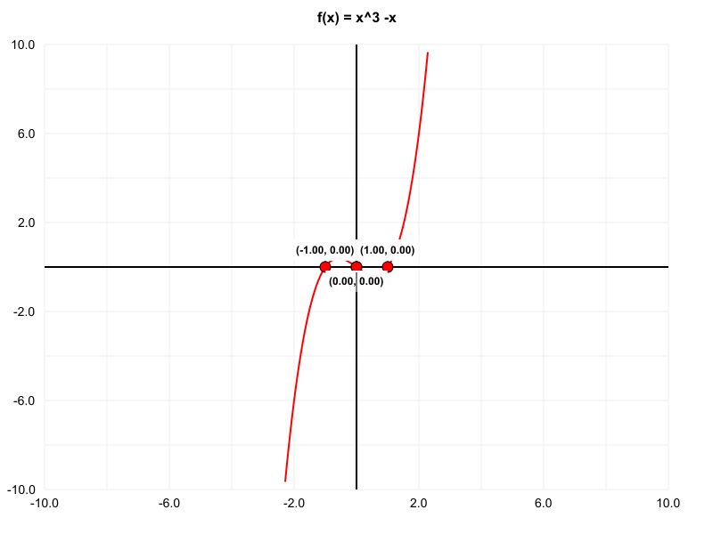

# GraphingJS

A powerful command-line graphing tool that creates high-resolution plots and interactive HTML visualizations of mathematical expressions.

## Features

- **High-Resolution PNG Plots**: Generate crisp, publication-quality static images
- **Interactive HTML Plots**: Create fully interactive web-based graphs with zoom, pan, and point selection
- **ASCII Terminal Plots**: Display graphs directly in the terminal with customizable resolution
- **Color Customization**: Full control over plot colors with interactive prompts
- **Smart Point Detection**: Automatically finds and highlights x-intercepts, y-intercepts, and grid points
- **Real-time Coordinates**: Hover to see exact coordinates on the graph
- **Point Selection**: Click to select and persist points across zoom/pan operations
- **Mathematical Expression Support**: Uses MathJS for robust mathematical evaluation

## Installation

### Prerequisites
- Node.js (version 18 or higher)
- npm

### Install Globally
```bash
npm install -g graphingjs
```

This will make the `graph` command available globally on your system.

## Usage

### Basic Command Structure
```bash
graph plot <expression> [options]
```

### Examples

#### Simple Static Plot
```bash
graph plot "x^2 + 2*x + 1"
```

#### Interactive HTML Plot
```bash
graph plot "sin(x)" --interactive
```

#### Custom Range and Resolution
```bash
graph plot "x^3 - 4*x" -x -5 -X 5 -y -10 -Y 10 -w 1200 -h 800
```

#### With Point Detection
```bash
graph plot "x^2 - 4" --interactive --points 1
```

#### ASCII Terminal Plot
```bash
graph plot "sin(x)" --ascii -w 60 -h 20
```

## Command Reference

### Main Commands

| Command | Description | Example |
|---------|-------------|---------|
| `graph --version` | Show version information | `graph --version` |
| `graph --help` | Show help information | `graph --help` |
| `graph plot <expression>` | Plot a mathematical expression | `graph plot "x^2"` |

### Plot Options

| Option | Short | Description | Default | Example |
|--------|-------|-------------|---------|---------|
| `--xmin <number>` | `-x` | Minimum x value | `-10` | `-x -5` |
| `--xmax <number>` | `-X` | Maximum x value | `10` | `-X 5` |
| `--ymin <number>` | `-y` | Minimum y value | `-10` | `-y -5` |
| `--ymax <number>` | `-Y` | Maximum y value | `10` | `-Y 5` |
| `--width <number>` | `-w` | Plot width in pixels/characters | `800` | `-w 1200` |
| `--height <number>` | `-h` | Plot height in pixels/characters | `600` | `-h 800` |
| `--output <filename>` | `-o` | Output filename | `plot.png` or `plot.htm` | `-o my_plot.png` |
| `--default` | `-d` | Use default colors without prompting | `false` | `--default` |
| `--interactive` | `-i` | Create interactive HTML plot | `false` | `--interactive` |
| `--ascii` | `-a` | Create ASCII plot for terminal output | `false` | `--ascii` |
| `--points <number>` | `-p` | Point interval for selectable points | `0` (none) | `-p 1` |

### Output Types

| Type | Flag | Description | Output Format | Example |
|------|------|-------------|---------------|---------|
| **Static PNG** | (default) | High-resolution image file | `.png` | `graph plot "x^2"` |
| **Interactive HTML** | `--interactive` | Web-based interactive plot | `.htm` | `graph plot "sin(x)" -i` |
| **ASCII Terminal** | `--ascii` | Text-based terminal output | Console text | `graph plot "cos(x)" -a` |

### Color Customization Options

When not using `--default`, the tool prompts for these colors:

| Color Setting | Description | Default | Example Input |
|---------------|-------------|---------|---------------|
| **Website Background** | Main page background | `#ffffff` (white) | `#f0f0f0` |
| **Grid Background** | Plot area background | `#f8f8f8` (light gray) | `#e8e8e8` |
| **Grid Lines** | Minor grid lines | `#e0e0e0` (light gray) | `#d0d0d0` |
| **Grid Main Lines** | Major grid lines (axes) | `#000000` (black) | `#333333` |
| **Origin** | Origin point color | `#ffff00` (yellow) | `#ffaa00` |
| **X Intercept Points** | X-intercept markers | `#ff0000` (red) | `#cc0000` |
| **Y Intercept Points** | Y-intercept markers | `#ff0000` (red) | `#cc0000` |
| **Grid Points** | General grid points | `#ff000080` (translucent red) | `#ff0000` |
| **Selected Points** | Selected point color | `#0000ff` (blue) | `#0066cc` |


## Interactive Features

### Navigation
- **Pan**: Click and drag to move the graph
- **Zoom**: Scroll wheel to zoom in/out
- **Reset**: Use the "Reset" button to return to original view

### Point Detection
- **X-intercepts**: Automatically detected and highlighted
- **Y-intercepts**: Automatically detected and highlighted
- **Grid Points**: Optional points at regular intervals (set with `--points`)
- **Hover**: Hover over points to highlight them
- **Selection**: Click points to select them (coordinates displayed)
- **Persistence**: Selected points remain selected during pan/zoom

### Coordinate Display
- **Real-time**: Hover over the graph to see exact coordinates
- **Selected Points**: Click points to see their coordinates with labels

## Mathematical Expressions

The tool supports a wide range of mathematical expressions using MathJS:

### Basic Operations
```bash
graph plot "x + 2"
graph plot "x^2 - 4"
graph plot "sin(x)"
graph plot "cos(x)"
graph plot "tan(x)"
```

### Advanced Functions
```bash
graph plot "exp(x)"
graph plot "log(x)"
graph plot "sqrt(x)"
graph plot "abs(x)"
```

### Complex Expressions
```bash
graph plot "x^3 - 2*x^2 + x - 1"
graph plot "sin(x) * cos(x)"
graph plot "1 / (x^2 + 1)"
```

## Usage Examples

### Basic Plotting

#### Static PNG Plots
```bash
# Simple quadratic function
graph plot "x^2"

# Custom range and resolution
graph plot "x^3 - 4*x" -x -5 -X 5 -y -10 -Y 10 -w 1200 -h 800

# Custom output filename
graph plot "sin(x)" -o my_sine_wave.png

# Use default colors (skip prompts)
graph plot "cos(x)" --default
```

#### Interactive HTML Plots

```bash
# Basic interactive plot
graph plot "sin(x)" --interactive

# With custom range
graph plot "x^2 - 4" -x -5 -X 5 -y -10 -Y 10 --interactive

# With point detection
graph plot "x^3 - 3*x" --interactive --points 1

# Custom output filename
graph plot "tan(x)" --interactive -o tangent_graph.htm
```

#### ASCII Terminal Plots

```bash
# Basic ASCII plot
graph plot "x^2" --ascii

# High-resolution ASCII
graph plot "sin(x)" --ascii -w 120 -h 30

# Compact ASCII with custom range
graph plot "cos(x)" --ascii -w 40 -h 15 -x -2 -X 2

# ASCII with default colors
graph plot "exp(x)" --ascii --default
```

### Mathematical Function Examples

#### Trigonometric Functions

```bash
# Sine wave
graph plot "sin(x)" --interactive

# Cosine with custom range
graph plot "cos(x)" -x -2*pi -X 2*pi --interactive

# Tangent (be careful with asymptotes)
graph plot "tan(x)" -x -pi -X pi -y -5 -Y 5 --interactive

# ASCII sine wave
graph plot "sin(x)" --ascii -w 80 -h 20
```

#### Polynomial Functions

```bash
# Quadratic
graph plot "x^2 - 4" --interactive

# Cubic with points
graph plot "x^3 - 3*x" --interactive --points 1

# Quartic
graph plot "x^4 - 5*x^2 + 4" --interactive

# High-degree polynomial
graph plot "x^5 - 5*x^3 + 4*x" -x -3 -X 3 --interactive
```

#### Rational Functions

```bash
# Simple rational
graph plot "1/x" -x -5 -X 5 -y -5 -Y 5 --interactive

# More complex rational
graph plot "(x^2 - 1)/(x^2 + 1)" --interactive

# Rational with asymptotes
graph plot "(x^2 - 4)/(x - 2)" -x -5 -X 5 --interactive
```

#### Exponential and Logarithmic

```bash
# Exponential
graph plot "exp(x)" -x -2 -X 2 --interactive

# Natural logarithm
graph plot "log(x)" -x 0.1 -X 5 --interactive

# ASCII exponential
graph plot "exp(x)" --ascii -w 60 -h 20 -x -2 -X 2
```

#### Advanced Functions

```bash
# Square root
graph plot "sqrt(x)" -x 0 -X 10 --interactive

# Absolute value
graph plot "abs(x)" --interactive

# Power function
graph plot "x^0.5" -x 0 -X 10 --interactive

# Reciprocal
graph plot "1/x^2" -x -5 -X 5 -y 0 -Y 5 --interactive
```

### Complex Expressions

```bash
# Combined functions
graph plot "sin(x) * cos(x)" --interactive

# Polynomial with trigonometric
graph plot "x^2 + sin(x)" --interactive

# Exponential with polynomial
graph plot "exp(-x^2)" -x -3 -X 3 --interactive

# Logarithmic with polynomial
graph plot "log(x^2 + 1)" -x -5 -X 5 --interactive
```

### Special Use Cases

```bash
# Very high resolution static plot
graph plot "x^3" -w 2000 -h 1500 -o high_res_cubic.png

# Compact ASCII for quick preview
graph plot "sin(x)" --ascii -w 30 -h 10

# Interactive with many points
graph plot "x^2" --interactive --points 0.5 -o detailed_parabola.htm

# ASCII with custom range
graph plot "1/x" --ascii -w 50 -h 20 -x -5 -X 5 -y -3 -Y 3
```

## Output Files

### Static Plots

- **Format**: PNG image
- **Default**: `plot.png`
- **Custom**: Use `-o filename.png`

### Interactive Plots

- **Format**: HTML file
- **Default**: `plot.htm`
- **Custom**: Use `-o filename.htm`

### ASCII Terminal Plots

- **Format**: Text output to terminal
- **Resolution**: Customizable with `-w` and `-h` options
- **Characters**: Uses `*`, `-`, `|`, `+`, `=` for plotting

## Technical Details

### Dependencies

- **commander**: Command-line interface parsing
- **mathjs**: Mathematical expression evaluation
- **canvas**: High-resolution image generation
- **readline-sync**: Interactive color prompts

### Browser Compatibility

Interactive HTML plots work in all modern browsers that support:
- HTML5 Canvas
- JavaScript ES6+
- CSS3

## Examples



`graph plot "x^3 -x" -o example-static.png -d`

## License

This project is licensed under the Apache License 2.0 - see the [LICENSE.txt](LICENSE.txt) file for details.

## Contributing

Contributions are welcome! Please feel free to submit a Pull Request.

## Author

**MaSoVaX (genZrizzCode)**

- GitHub: [@genZrizzCode](https://github.com/genZrizzCode)
- Project: [graphingjs](https://github.com/genZrizzCode/graphingjs)

## Acknowledgments

- Built with [MathJS](https://mathjs.org/) for mathematical expression evaluation
- Uses [Commander.js](https://github.com/tj/commander.js) for CLI interface
- Canvas rendering powered by [node-canvas](https://github.com/Automattic/node-canvas)

## License

[Apache 2.0 License](LICENSE.txt)